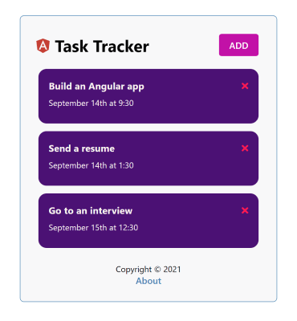
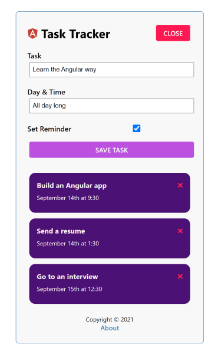
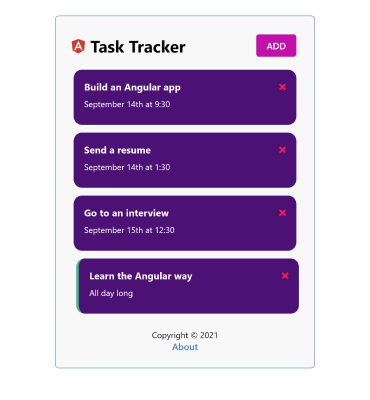

# Angular task tracker

> In this project, I created a task tracker based on Angular Crash Course by Traversy Media.
> This simple task tracker allows user to add new and delete added tasks.
> Users can input task name, date and time. Also users can set a reminder for a task (that highlight it with green color) by checking a mark or by double clicking on a task.

## App Screenshots

This project was generated with [Angular CLI](https://github.com/angular/angular-cli) version 12.2.5.

## Development server

Run `ng serve` for a dev server. Navigate to `http://localhost:4200/`. The app will automatically reload if you change any of the source files.

Alternatively you can use 'ng serve --open'. This will open `http://localhost:4200/` in a browser for you.

## JSON-server

The app emulates work with backend using local JSON-server extension.

To make the app work, you should also run local json-server using `npm run server` command. Server will be run at `http://localhost:5000`.

## Code scaffolding

Run `ng generate component component-name` to generate a new component. You can also use `ng generate directive|pipe|service|class|guard|interface|enum|module`.

## Build

Run `ng build` to build the project. The build artifacts will be stored in the `dist/` directory.

## Running unit tests

Run `ng test` to execute the unit tests via [Karma](https://karma-runner.github.io).

## Running end-to-end tests

Run `ng e2e` to execute the end-to-end tests via a platform of your choice. To use this command, you need to first add a package that implements end-to-end testing capabilities.

## Further help

To get more help on the Angular CLI use `ng help` or go check out the [Angular CLI Overview and Command Reference](https://angular.io/cli) page.
